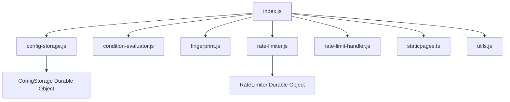
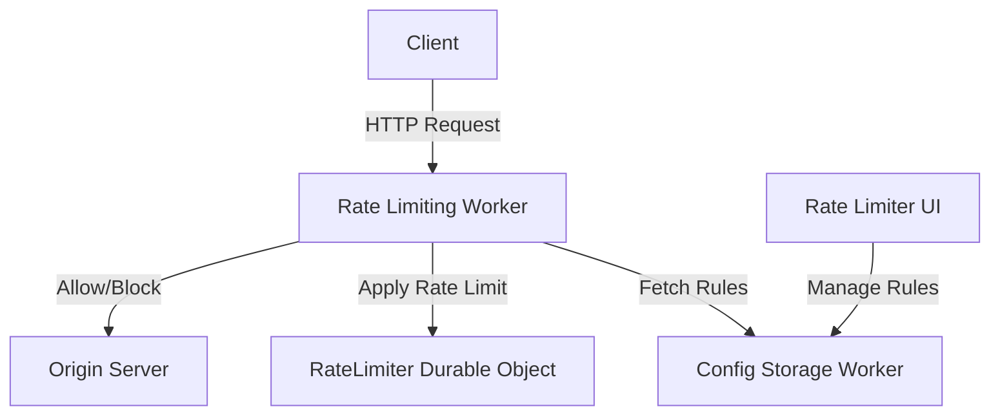
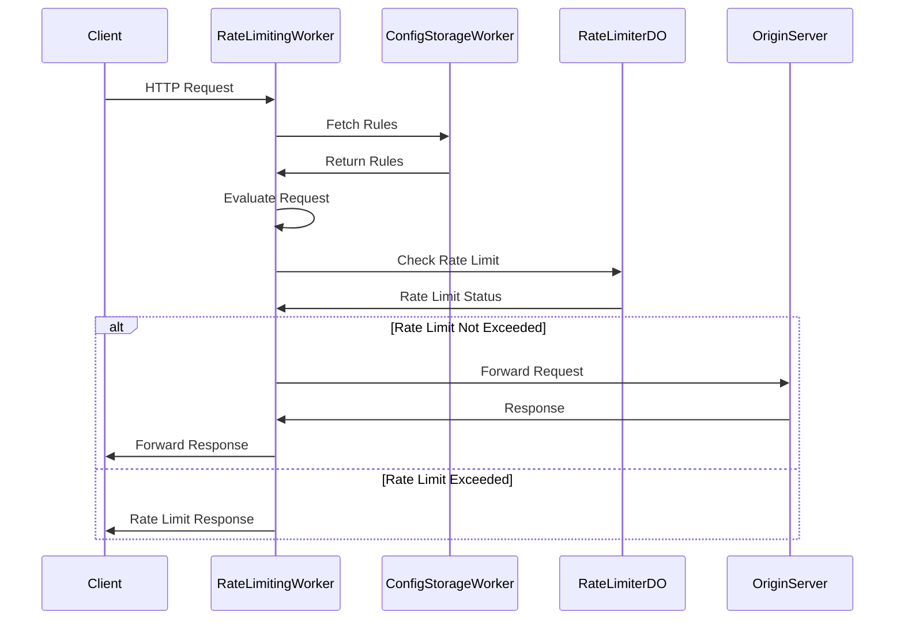

# Rate Limiting Worker

## Table of Contents
1. [Overview](#overview)
2. [Project Structure](#project-structure)
3. [Key Components](#key-components)
4. [System Architecture](#system-architecture)
5. [Workflow](#workflow)
6. [Rate Limiting Logic](#rate-limiting-logic)
7. [Configuration](#configuration)
8. [API Endpoints](#api-endpoints)
9. [Durable Objects](#durable-objects)
10. [Development](#development)
11. [Deployment](#deployment)
12. [Testing](#testing)
13. [Error Handling and Logging](#error-handling-and-logging)
14. [Security Considerations](#security-considerations)
15. [Limitations](#limitations)
16. [Future Improvements](#future-improvements)
17. [Related Components](#related-components)

## Overview

The Rate Limiting Worker is a Cloudflare Worker designed to implement rate limiting based on configurable rules. It works in conjunction with the Rate Limit Configurator UI and Config Storage Worker, fetching rules from a shared Durable Object and applying them to incoming requests.

## Project Structure

```
do-rl-worker/
├── src/
│   ├── config-storage.js
│   ├── condition-evaluator.js
│   ├── fingerprint.js
│   ├── index.js
│   ├── rate-limiter.js
│   ├── rate-limit-handler.js
│   ├── staticpages.ts
│   └── utils.js
├── package.json
└── wrangler.toml
```

## Key Components



1. **index.js**: The main entry point for the worker. It handles incoming requests, fetches the configuration, finds matching rules, and applies rate limiting.
2. **config-storage.js**: Manages fetching and caching of rate limiting rules from the Config Storage Worker.
3. **condition-evaluator.js**: Provides functions for evaluating conditions defined in the rate limiting rules.
4. **fingerprint.js**: Handles the generation of unique identifiers for requests based on configured parameters.
5. **rate-limiter.js**: Contains the `RateLimiter` class, which implements the core rate limiting logic.
6. **rate-limit-handler.js**: Handles rate limit checking and response modification.
7. **staticpages.ts**: Serves static HTML pages for rate limit notifications and information.
8. **utils.js**: Contains utility functions for cryptographic operations.

## System Architecture



## Workflow



## Rate Limiting Logic

The rate limiting is based on a sliding window algorithm. Each client is identified by a unique fingerprint generated from configurable request properties. The worker tracks the number of requests made by each client within the specified time window.

## Configuration

The rate limiting rules are stored in and fetched from a `ConfigStorage` Durable Object. Each rule can specify:

- Rate limit (requests per time period)
- Fingerprint parameters
- Matching conditions
- Actions to take when rate limit is exceeded

## API Endpoints

The worker handles the following special endpoints:

- `/_ratelimit`: Returns information about the current rate limit status for the client.

## Durable Objects

The worker uses two types of Durable Objects:

1. **ConfigStorage**: Stores and manages the rate limiting rules (via the Config Storage Worker).
2. **RateLimiter**: Implements the rate limiting logic for each unique client identifier.

## Development

1. Clone the repository:
   ```
   git clone https://github.com/erfianugrah/rate-limiter-worker.git
   cd rate-limiter-worker
   ```

2. Install dependencies:
   ```
   npm install
   ```

3. Run the development server:
   ```
   npm run dev
   ```

This command starts a local development server that simulates the Cloudflare Workers environment.

## Deployment

To deploy the worker:

1. Ensure you have the Wrangler CLI installed and authenticated with your Cloudflare account.
2. Run the following command in the project directory:
   ```
   npm run deploy
   ```

## Testing

To test the rate limiting functionality, you can use the provided `rate-limit-tester.py` script. This script allows you to simulate multiple requests and analyze the rate limiting behavior.

Usage:
```
python rate-limit-tester.py -u <URL> -n <NUMBER_OF_REQUESTS> -d <DELAY_BETWEEN_REQUESTS>
```

The script provides detailed output, including response times, status codes, and rate limit headers. It also generates a graph of the results, saved as `rate_limit_test_results.png`.

## Error Handling and Logging

The worker includes extensive logging throughout its execution. In production, these logs can be viewed in the Cloudflare dashboard. Errors are caught and logged, with the worker attempting to gracefully handle failures by passing through requests when errors occur.

## Security Considerations

- Ensure that the worker is deployed with appropriate access controls to prevent unauthorized manipulation of rate limiting rules.
- The worker trusts headers like `true-client-ip` and `cf-connecting-ip` for client identification. Ensure these are set correctly in your Cloudflare configuration.
- Consider implementing additional security measures such as API key validation for the configuration endpoints.

## Limitations

- The current implementation has a hard-coded body size limit for fingerprinting and condition evaluation.
- The configuration is cached to reduce Durable Object reads. This means that rule changes may take some time to propagate.

## Future Improvements

- Implement more sophisticated caching mechanisms for configuration and rate limit data.
- Add support for more complex rate limiting scenarios, such as tiered limits or dynamic limits based on user behavior.
- Enhance the fingerprinting capabilities to support more complex client identification schemes.
- Implement better error handling and fallback mechanisms.
- Add more comprehensive logging and monitoring capabilities.

## Related Components

This Rate Limiting Worker is part of a larger rate limiting system. The other components are:

1. [Rate Limiter UI](https://github.com/erfianugrah/rate-limiter-ui): Provides a user interface for managing rate limiting rules.
2. [Rate Limiter Config Storage](https://github.com/erfianugrah/rate-limiter-config-storage): Stores and manages the rate limiting rules.

For a complete setup, ensure all components are properly configured and deployed.
